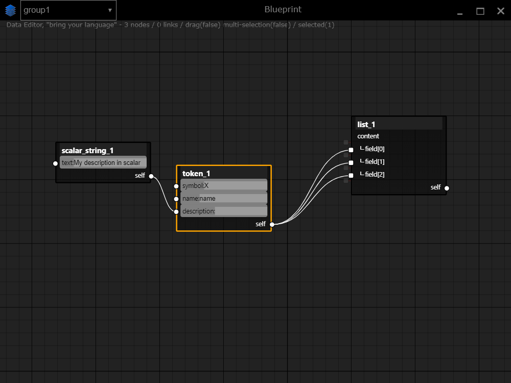
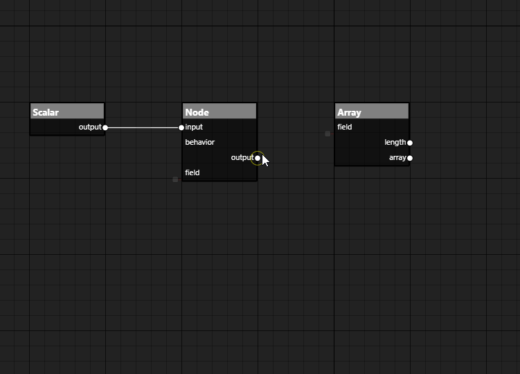

# blueprint

> Work in progress

## Features:
* Toolbox (imported from generic format)
* edit constant values in a form (string, number)
* multi-workspace
* Workspace as a template
* Desktop App multiplaform (electron)
* the model support multi-binding

## Issues

* create link > select a node not connected > delete the node
  * excepted : link hasn't to delete

## Wishlist

* Export engine (templating with Nunjucks lib)
* backend-server for multi-users usage 

## TODO

* publish electron App: https://medium.com/@johndyer24/creating-and-deploying-an-auto-updating-electron-app-for-mac-and-windows-using-electron-builder-6a3982c0cee6
